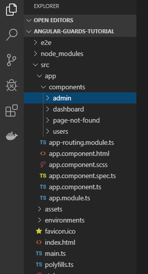
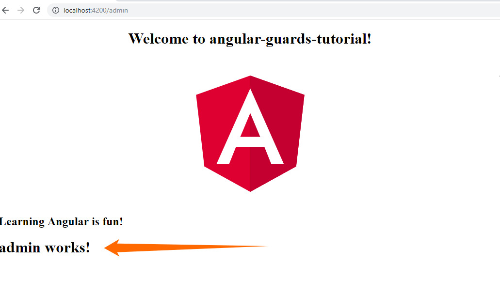
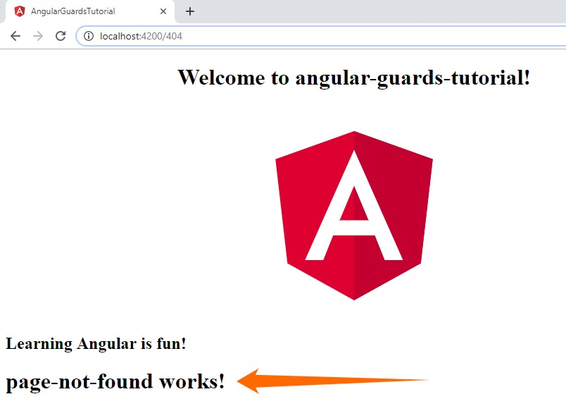
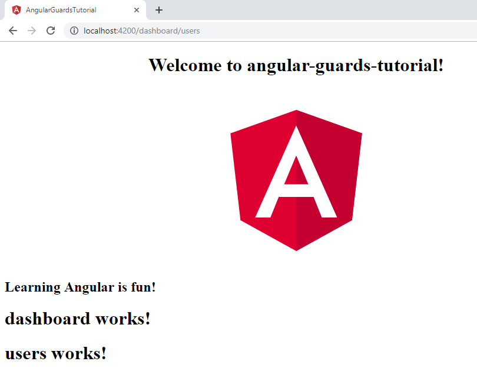

# How to Use Guards to Protect Routes in Angular
Angular routing plays a significant role in enabling navigation between pages, as users perform various tasks in an application. 
Furthermore, Angular provides route guards that you can use to add a layer of protection to your application and restrict users from accessing certain pages. 

For example, if you have an admin page at **/admin**, you can prevent a regular user from seeing that page.

In this tutorial, we’re going to talk about how to use route guards to enhance the security of your Angular applications.
## Importance of protecting routes
Angular route guards let you remove or grant access to certain aspects of the navigation—which increases the security of your application, instead of opening the doors to everyone, anytime.

Here are some situations when determining how users can access certain pages is important:
* If you want to prevent an unauthorized user from accessing the target page.
* If you want to ensure that a user is logged-in (authenticated) before accessing the page.
* If you want to fetch some data from an external source before showing it on the page.
* If you want to ensure that the pending changes are saved before a user can leave a page.
## How to protect routes
Here are the five types of guard interfaces that you can include to your app’s route configuration and handle various access scenarios:
1. **CanActivate**— adds a check for route navigation before a component is deployed. With this guard, you can permit or deny access to a feature based on the credentials of the user.
2. **CanActivateChild** –adds a check for the route children before a component is deployed. It works just like the **CanActivate** guard.
3. **CanDeactivate**—adds a check for navigation away from the current route, such as leaving a page without filling the form.
4. **Resolve**—adds a check for retrieving or loading route data before the route is activated.
5. **CanLoad**—adds a check for navigating to a feature module that loaded asynchronously.

A guard’s return value will determine what takes place to the router. Here are the possible behaviors:
* If the return value is `true`, then the navigation proceeds.
* If the return value is `false`, then the navigation halts, and the user is not directed anywhere else. It’s also possible that if the guard returns `false`, it can be tailored to instruct the router to navigate to another page, effectively nullifying the present navigation. 

To assist in establishing if a guard interface should allow or disallow an access request, a guard method can be called, with the following parameters passed:
1.	`next: ActivatedRouteSnapshot` —the next route that will be activated in case the guard is permitting access. 
2.	`state: RouterStateSnapshot` —the next router state in case the guard is permitting access.

The guard method can return a `Promise` or `Observable` of a `Boolean` value. It can also return just a `Boolean` value itself. 
## How to use route guards
For the rest of this tutorial, we’ll only be talking about **CanActivate** and **CanActivateChild** guards. Eventually, after learning how to apply these two guards, you can use the same procedure to implement the other remaining ones in your Angular application.

Here is what we want to achieve by the end of this tutorial:
* Only admins can access the admin page at **/admin** section.
* Only logged in users can access the **/dashboard/users** section.

Now, let’s start getting our hands dirty!
## Creating a simple app
After installing the Angular CLI, we’ll use it to create a simple app for demonstrating how to set up route guards on Angular applications.

Let’s run the following code on the command line interface:

`ng new angular-guards-tutorial`

This will create a new app, with routing capabilities configured (if you agreed to enable routing during the installation process).

The CLI also created an `AppComponent` that we’ll use as the home page (or the default route) for this simple application. 

Since we enabled routing during the installation process, the `AppComponent` came with a `RouterOutlet` ( `<router-outlet>` ) directive that acts as a placeholder for loading various components dynamically according to the activated component or the present route state.

```html
<!--app.component.html-->
<div style="text-align:center">
 <h1>
   Welcome to {{ title }}!
 </h1>
 
</div>
<h2>Learning Angular is fun!</h2>
 
<router-outlet></router-outlet>

```

### Creating app sections
We’ll need our app to have the following pages:
* admin page
* dashboard page
* users page
* page-not-found page

Let’s run the following codes to create those components under the **components** folder:

`ng generate component components/admin`

`ng generate component components/dashboard`

`ng generate component components/users`

`ng generate component components/page-not-found`

Here is a screenshot showing the structure of our project on the Visual Studio Code editor:



The Angular CLI will automatically include the generated components on the **app.module.ts** file, which is where the root module for our app resides.

```typescript
/* app.module.ts */
import { BrowserModule } from '@angular/platform-browser';
import { NgModule } from '@angular/core';
import { AppRoutingModule } from './app-routing.module';
import { AppComponent } from './app.component';
/* generated components */
import { AdminComponent } from './components/admin/admin.component';
import { DashboardComponent } from './components/dashboard/dashboard.component';
import { UsersComponent } from './components/users/users.component';
import { PageNotFoundComponent } from './components/page-not-found/page-not-found.component';
 
@NgModule({
 declarations: [
   AppComponent,
   AdminComponent,
   DashboardComponent,
   UsersComponent,
   PageNotFoundComponent
 ],
 imports: [
   BrowserModule,
   AppRoutingModule
 ],
 providers: [],
 bootstrap: [AppComponent]
})
export class AppModule { } 

```
We only need to import the components and configure their routes on the **app-routing.module.ts** file. 

Here is how we set up their routing:

```typescript
/*app-routing.module.ts */
import { NgModule } from '@angular/core';
import { Routes, RouterModule } from '@angular/router';
import { AdminComponent } from './components/admin/admin.component';
import { DashboardComponent } from './components/dashboard/dashboard.component';
import { UsersComponent } from './components/users/users.component';
import { PageNotFoundComponent } from './components/page-not-found/page-not-found.component';
 
const routes: Routes = [
{
 path: 'admin',
 component: AdminComponent
},
{
 path: '404',
 component: PageNotFoundComponent
},
 
];
 
@NgModule({
 imports: [RouterModule.forRoot(routes)],
 exports: [RouterModule]
})
export class AppRoutingModule { }

```
With the routing configuration above, for example, when the browser URL for this app becomes **/admin**, the router assigns that URL to the route path **/admin** and shows the `AdminComponent` as a sibling element to the `AppComponent`. 

Remember that we specified the `RouterOutlet` in the **app.component.html** file. 

If we browse to [http://localhost:4200/admin](http://localhost:4200/admin), we’ll see a message at the bottom of the page that says **“admin-works!”**.



Until this point, anyone can access the **admin** page, which is undesirable, especially if the section contains some sensitive information that should only be displayed to the application’s administrators.

Therefore, we’ll create route guards to prevent unauthorized users from accessing the **admin** page.
### Creating the authentication service
Let’s create a generic authentication service that we’ll use to validate whether a user is an admin or not. In this case, we’ll return a Boolean for `true`, validating that the user is an admin. 

In a real-world application, you can hook this authentication logic into a backend API that does the verification. It’s a very insecure practice to allow your authentication service to always return `true`.

Now, let’s use the CLI to create this service:

`ng generate service authentication/authentication`

We’ll also include a method that checks for `isAdmin` status.

Here is the authentication service in all its glory:

```typescript
/* authentication.service.ts */
import { Injectable } from '@angular/core';
 
@Injectable({
 providedIn: 'root'
})
export class AuthenticationService {
 
 constructor() { }
 
 get isAdmin(){
   /* using the get keyword allows us to access the function as a property */
   return true;
 }
}
```

Consequently, the authentication service is ready to be used in the route guard.
### Creating the authentication guard
Since we need a guard interface to validate the admin status of a user, we’ll use the CLI to create it.

`ng generate guard authentication/guards`

Here is the new guard:

```typescript
/* guards.guard.ts */
import { Injectable } from '@angular/core';
import { CanActivate, CanActivateChild, ActivatedRouteSnapshot, RouterStateSnapshot, UrlTree } from '@angular/router';
import { Observable } from 'rxjs';
 
@Injectable({
 providedIn: 'root'
})
export class GuardsGuard implements CanActivate, CanActivateChild {
 canActivate(
   next: ActivatedRouteSnapshot,
   state: RouterStateSnapshot): Observable<boolean | UrlTree> | Promise<boolean | UrlTree> | boolean | UrlTree {
   return true;
}
 canActivateChild(
   next: ActivatedRouteSnapshot,
   state: RouterStateSnapshot): Observable<boolean | UrlTree> | Promise<boolean | UrlTree> | boolean | UrlTree {
   return true;
}
} 

```

As you can see from the code above, the `CanActivate` and `CanActivateChild` interfaces are implemented by declaring the `canActivate` and `canActivateChild` methods respectively (notice the difference in capitalization in “c”). 

And, as earlier explained, the method returns `true` or `false`—depending on the desired navigation process.

Next, we’ll add the `AuthenticationService` to check the admin status of the users and the `Router` to redirect them if they are not validated. We’ll apply them to the `canActivate` method.

```typescript
/* guards.guard.ts */
import { Injectable } from '@angular/core';
import { CanActivate, CanActivateChild, ActivatedRouteSnapshot, RouterStateSnapshot, UrlTree, Router } from '@angular/router';
import { Observable } from 'rxjs';
import { AuthenticationService } from './authentication.service';
 
@Injectable({
 providedIn: 'root'
})
export class GuardsGuard implements CanActivate, CanActivateChild {
 
 constructor(
   private auth: AuthenticationService,
   private router: Router
 ){}
 canActivate(
   next: ActivatedRouteSnapshot,
   state: RouterStateSnapshot): Observable<boolean | UrlTree> | Promise<boolean | UrlTree> | boolean | UrlTree {
  
   /* redirect the navigation and return false */
   if(!this.auth.isAdmin){
     this.router.navigate(['404'])
   }
   return true;
 }
 
 }
 
```

### Registration with AppModules
After creating the authentication service and guard, let’s now register them in the app’s `AppModules` as providers. Whereas the Angular CLI registers components in the `AppModules` automatically, services need to be registered manually.

```typescript
/* app.module.ts */
import { BrowserModule } from '@angular/platform-browser';
import { NgModule } from '@angular/core';
import { AppRoutingModule } from './app-routing.module';
import { AppComponent } from './app.component';
import { AdminComponent } from './components/admin/admin.component';
import { DashboardComponent } from './components/dashboard/dashboard.component';
import { UsersComponent } from './components/users/users.component';
import { PageNotFoundComponent } from './components/page-not-found/page-not-found.component';
import { AuthenticationService } from './authentication/authentication.service';
import { GuardsGuard } from './authentication/guards.guard';
 
@NgModule({
 declarations: [
   AppComponent,
   AdminComponent,
   DashboardComponent,
   UsersComponent,
   PageNotFoundComponent
 ],
 imports: [
   BrowserModule,
   AppRoutingModule
 ],
 providers: [
   AuthenticationService,
   GuardsGuard
 ],
 bootstrap: [AppComponent]
})
export class AppModule { } 

```

We are now good to go!
### Tying the guard to the route
Finally, let's tie the guard to the route we want to safeguard from unauthorized access.

Here is how we apply it:

```typescript
/*app-routing.module.ts */
...
import { GuardsGuard } from './authentication/guards.guard';
 
const routes: Routes = [
{
 path: 'admin',
 component: AdminComponent,
 canActivate: [GuardsGuard]
},
];
 
...

```
### Let’s test…
Let’s imagine that an unauthenticated user wants to access the **/admin** page. To meet this condition, let’s go back into the `AuthenticationService` and change the return value of the `isAdmin` method to `false`.

```typescript
/* authentication.service.ts */
...
 
 get isAdmin(){
 
    return false;
 }

```
Now, if we visit [http://localhost:4200/admin](http://localhost:4200/admin) on the browser, we’ll be redirected to the [http://localhost:4200/404](http://localhost:4200/404) page.




Hurray!
So, we’ve achieved our objective of ensuring that only authorized users can access the admin page at **/admin**. 
## Using CanActivateChild
Do you remember that we also wanted to ensure that only logged in users can access the **/dashboard/users** section?

We’ll use the `CanActivateChild` guard interface to help us achieve that possibility.

Let’s start by adding a new `RouterOutlet` to the **dashboard.component.html** file:

```typescript
<!--dashboard.component.html-->
<h1>dashboard works!</h1>
 
<router-outlet></router-outlet>
```
Next, let’s add an `isLoggedIn` method to the `AuthenticationService`:

```typescript
/* authentication.service.ts */
import { Injectable } from '@angular/core';
 
@Injectable({
 providedIn: 'root'
})
export class AuthenticationService {
 
 constructor() { }
 
 get isAdmin(){
    /* using the get keyword allows us to access the function as a property */  
     
     return true;
 }
 
 get isLoggedIn(){
 
    return true;
 }
} 

```
Then, let’s make some improvements to our `GuardsGuard` service to implement the `canActivateChild` method:

```typescript
/* guards.guard.ts */
import { Injectable } from '@angular/core';
import { CanActivate, CanActivateChild, ActivatedRouteSnapshot, RouterStateSnapshot, UrlTree, Router } from '@angular/router';
import { Observable } from 'rxjs';
import { AuthenticationService } from './authentication.service';
 
@Injectable({
 providedIn: 'root'
})
export class GuardsGuard implements CanActivate, CanActivateChild {
 
 constructor(
   private auth: AuthenticationService,
   private router: Router
 ){}
 canActivate(
   next: ActivatedRouteSnapshot,
   state: RouterStateSnapshot): Observable<boolean | UrlTree> | Promise<boolean | UrlTree> | boolean | UrlTree {
  
   /* redirect the navigation and return false */
   if(!this.auth.isAdmin){
     this.router.navigate(['404'])
   }
   return true;
 }
 canActivateChild(
   next: ActivatedRouteSnapshot,
   state: RouterStateSnapshot): Observable<boolean | UrlTree> | Promise<boolean | UrlTree> | boolean | UrlTree {
  
     /* redirect the navigation and return false */
    if(!this.auth.isLoggedIn){
       this.router.navigate(['404'])
    }
   return true;
 }
 }
 
```

Finally, let’s apply the updates to our **app-routing.module.ts** file:

```typescript
/*app-routing.module.ts */
import { NgModule } from '@angular/core';
import { Routes, RouterModule } from '@angular/router';
import { AdminComponent } from './components/admin/admin.component';
import { DashboardComponent } from './components/dashboard/dashboard.component';
import { UsersComponent } from './components/users/users.component';
import { PageNotFoundComponent } from './components/page-not-found/page-not-found.component';
import { GuardsGuard } from './authentication/guards.guard';
 
const routes: Routes = [
{
 path: 'admin',
 component: AdminComponent,
 canActivate: [GuardsGuard]
},
{
 path: 'dashboard',
 component: DashboardComponent,
 canActivateChild: [GuardsGuard],
 children: [
   {
     path: 'users',
     component: UsersComponent
   }
 ]
},
{
 path: '404',
 component: PageNotFoundComponent
},
 
];
 
@NgModule({
 imports: [RouterModule.forRoot(routes)],
 exports: [RouterModule]
})
export class AppRoutingModule { }

```


Now, here is what we’ll see if we visit [http://localhost:4200/dashboard/users]( http://localhost:4200/dashboard/users)  on the browser:





So, our guard ensures that only logged in users can access the **/dashboard/users** section of our app. 

To test this, we can go back into the `AuthenticationService` and change the return value of the `isLoggedIn` method to `false`, and any further attempts to access the URL will be denied.
## Summary
Angular route guards are great. They provide an efficient way of “guarding” certain routes and ensuring the safety of your application. In this tutorial, we’ve demonstrated how you can use `CanActivate` and `CanActivateChild` guard interfaces to control the navigation of users in a simple app.

You can get the entire code used in this tutorial on [this GitHub repository](https://github.com/Alfrick/Angular-Guards-Tutorial.git). 

Do you have any questions or comments?

Please post them below.

Happy Angular coding!
## Where to go next
* Learn how to use the other types of route guards from the [Angular official documentation]( https://angular.io/guide/router#milestone-5-route-guards). 
* Learn how to use [Angular’s built-in features](https://angular.io/guide/security) to enhance the security of your applications.
* Learn how to use [JSON Web Tokens (JWT)]( https://jwt.io/introduction/) for authorizing users. 
## References
Here are some good resources about using guards in Angular:
* [Angular Router: Using Route Guards](https://alligator.io/angular/route-guards/)
* [YouTube video on how to use the CanActivate route guard in Angular]( https://www.youtube.com/watch?v=-17zqLtgy_0)
* [Angular Authentication: Using Route Guards]( https://medium.com/@ryanchenkie_40935/angular-authentication-using-route-guards-bf7a4ca13ae3)
